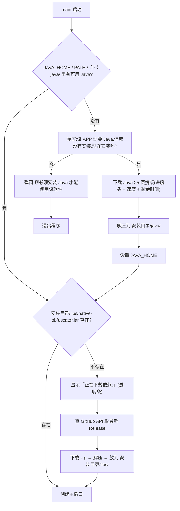

# 启动引导(Runtime Bootstrap)

AntiHackerX 现在是「绿色免安装」形态:可执行文件旁边不放任何东西也能跑起来,
首次启动会自动把缺的运行时和依赖补齐。

```
<安装目录>/
├── AntiHackerX(.exe)                    ← 主程序
├── java/                                ← 便携版 JDK 25(没有 Java 时自动下载)
│   └── bin/java(.exe)
├── libs/                                ← 运行依赖(自动从 GitHub Release 取最新版)
│   ├── native-obfuscator.jar
│   ├── LICENSE  NOTICE  README.md  MODIFICATIONS.md
└── .bootstrap-tmp/                      ← 临时目录,流程结束自动清理
```

---

## 启动顺序

主窗口显示**之前**,`src/main.cpp` 会构造 `RuntimeBootstrap` 并调用 `ensureReady()`:



用户拒绝安装 Java 时,程序会先弹一次说明再退出(退出码 0),
不会留下半成品目录。

---

## Java 检测顺序

`RuntimeBootstrap::detectJavaExecutable()` 按以下优先级探测,第一个能跑通
`java -version` 的胜出:

| 优先级 | 位置 | 说明 |
|---|---|---|
| 1 | `<安装目录>/java/bin/java` | 便携版。放在最前,保证绿色版自洽 —— 不会因为用户后来改了系统 `JAVA_HOME` 而行为漂移 |
| 2 | `$JAVA_HOME/bin/java` | 用户自己装过 JDK |
| 3 | `PATH` 上的 `java` | 兜底 |

最右侧的 `home` 会写进进程环境(`qputenv("JAVA_HOME", ...)`),
并通过 `QProcessEnvironment` 传给 native-obfuscator 子进程。

> 只有第 1、2、3 条都失败时才会弹窗询问。

---

## 便携版 Java 从哪来

用 **Eclipse Adoptium Temurin**(OpenJDK 官方构建,开源且允许再分发),
版本固定为 **JDK 25**(与 native-obfuscator 的运行要求一致)。

下载地址由 API 动态解析,不用写死文件名:

```
https://api.adoptium.net/v3/binary/latest/25/ga/<os>/<arch>/jdk/hotspot/normal/eclipse?project=jdk
```

| 平台 | `<os>` | `<arch>` | 包格式 |
|---|---|---|---|
| Windows | `windows` | `x64` / `aarch64` | `.zip` |
| Linux | `linux` | `x64` / `aarch64` | `.tar.gz` |
| macOS | `mac` | `x64` / `aarch64` | `.tar.gz` |

Adoptium 会 307 跳到 GitHub Releases,再 302 跳到 `release-assets.githubusercontent.com`,
所以下载器必须允许跟随重定向(见下)。

解压后包内有一层顶层目录(Windows/Linux 是 `jdk-25.0.4.1+1/`,
macOS 是 `jdk-25.jdk/Contents/Home/`),代码会自动识别并把它改名成
`<安装目录>/java`。

---

## 依赖从哪来

`https://github.com/xiaofanforfabric/native-obfuscator/releases/latest`

先请求 GitHub API 拿到 `tag_name` 与资产列表,挑选**名字以 `.zip` 结尾且不含 `-src`**
的那个(排除源码包),下载后解压到 `<安装目录>/libs/`。

压缩包根目录直接就是产物:

```
native-obfuscator.jar     ← 主程序需要的
LICENSE  NOTICE  README.md  MODIFICATIONS.md   ← GPL-3.0 要求随二进制分发
```

API 不可达(限流 / 断网)时回退到固定标签 `v1.4.0` 的直链;
两者都不行才报错,并在提示里告诉用户手工下载后该把 jar 放到哪个路径。

### ⏸ 规划中:kilij 虚拟化工具链(尚未实现)

若启用 kilij 编译期虚拟化,还需要一套**共享版 LLVM 20**(`libLLVM-20.so` +
`clang` + `opt` + `llvm-link`),官方静态 tarball **不可用**。

约束与方案见 [kilij 虚拟化层评估](KILIJ_INTEGRATION.md),要点:

- 依赖可**免 root** 获取:`apt.llvm.org` 的 Debian 包(约 114 MB 下载),
  用 `dpkg-deb -x` 解到 `<安装目录>/libs/llvm20/` 即可
- 同样依赖 GitHub API 取版本 + 断网回退,可复用本节既有的下载/解压组件
- **宿主 clang/opt 必须与插件同属一份 LLVM**,不能混用官方静态 clang
- 这是**打包者机器**的依赖,不是终端用户的依赖

---

## 三个可复用组件

### `src/downloader.{h,cpp}` —— 单文件 HTTP 下载器

* `QNetworkRequest::NoLessSafeRedirectPolicy` + `setMaximumRedirectsAllowed(20)`
  → 打通 Adoptium / GitHub 的多级重定向(全部 https,不会触发降级拦截)
* 边下边写盘(`readyRead` → `QFile::write`,以 `Unbuffered` 打开),
  不把 190 MB 塞进内存,而且磁盘上的字节数随时是准的
* `downloadProgress` 上报字节数,自己算瞬时速度与 ETA

**为什么需要自己写停滞看门狗:**

`QNetworkReply::setTransferTimeout()` 在代理场景下靠不住 —— 只要代理还零星地
送几个字节,计时器就重置,于是一个“连接还在但永远不出数据”的连接会把程序
永久挂住(本机走 `127.0.0.1:7890` 代理时实测复现过:下到 135 MB 后卡死不动)。

所以这里自己维护一个单次触发定时器,每收到一块数据就重启它;
`stallTimeoutMs`(引导流程用 45 秒)内没有新数据就判为失败。

**断点续传重试:**

失败后不从头再来,而是:

1. 以已有文件的字节数作为 `resumeOffset`
2. 重新请求时带上 `Range: bytes=<resumeOffset>-`
3. 服务器返回 `206` → 以 `Append` 模式继续写
4. 服务器**无视 Range 返回 `200`** → 说明它从头把整个文件又发了一遍,
   此时必须立即截断文件重写,否则会拼出两段内容
5. 重试等待 2s / 4s / 8s …,上限 `maxRetries`(引导流程用 5 次)

> 断点续传的拼装正确性是逐字节校验过的:用一个本地 HTTP 服务器发一半后
> 强行断开,客户端带 `Range` 重试,最终文件 SHA 与内容完全一致。

请求失败时的可重试判断:

| 情况 | 处理 |
|---|---|
| 用户点了取消 | 直接失败(删掉半截文件),不重试 |
| `404` / `403` 等确定性 4xx | 直接失败,重试没意义 |
| `408` / `429` / 5xx | 可重试 |
| 超时 / 连接被断 / DNS 抖动 | 可重试 |
| 拿到 `Content-Length` 但实际字节数不够 | 可重试 |

重试期间会发 `retrying` 信号,下载窗切成忙碌动画并显示
“连接不稳定,正在断点续传重试(N/M)…”。

### `src/download_dialog.{h,cpp}` —— 带进度条的模态窗口

阶段标题 + 进度条 + 「速度 / 剩余时间」明细行,支持取消。
`setBusy()` 切到不定进度动画(解压等没法估算的步骤用)。
下载中忽略关闭事件,避免用户误关留下半截文件。

### `src/archive.{h,cpp}` —— 解压

**为什么不用 Qt 自带的?** Qt6 的 `QZipReader` 在私有头文件 `qzipreader_p.h` 里,
发行版不带 `Qt6GuiPrivate` 的 CMake 配置,引用它会在用户机器上编译失败。

改成调用系统解压程序,按顺序试,并用「解压后文件数是否变多」做校验
(不看退出码 —— bsdtar 解 zip 时退出码不一定是 0):

| 顺序 | 命令 | 覆盖 |
|---|---|---|
| 1 | `tar -xf` | macOS / Windows 10 1803+ 自带的 bsdtar,zip 与 tar.gz 通吃 |
| 2 | `unzip -o -q` | Linux / macOS 标配 |
| 3 | `7z x -y -o` | 装了 7-Zip 的机器(优先级压最低,见下) |
| 4 | PowerShell `Expand-Archive` | Windows 兜底 |

> GNU tar 读不了 zip,但它会非 0 退出且不产出文件,被校验拦下后自动换下一个候选。
>
> 7-Zip 排在最后是因为它解 `.tar.gz` 时只剥一层壳、留下中间的 `.tar`,
> 会让「目录非空」的校验误判成功。

---

## 主窗口里的两个兜底入口

菜单 **工具(T)**:

* **重新下载运行依赖** → `RuntimeBootstrap::refreshNativeObfuscator()`
  强制重下最新版依赖(先删旧的),下载完立刻替换掉当前使用的 jar。
* **重新安装 Java 运行环境** → `RuntimeBootstrap::installPortableJava()`
  重装便携版 JDK 并重新探测,成功后会热切换 `ObfuscatorController` 用的 java。

这两个入口让「跳过下载」不再是死路:依赖坏了、想升级、想换 Java 版本都能自助。

---

## 只读安装位置的处理

如果程序装在 `C:\Program Files` 这类**不可写**目录(或 Linux 的 `/opt`),
启动引导会自动把 `java/` 和 `libs/` 放到
`QStandardPaths::AppDataLocation`(`%APPDATA%\AntiHackerX`、`~/.local/share/...`)。
`RuntimeBootstrap::installRoot()` 会告诉你是哪一个。

---

## 测试

`RuntimeBootstrap` 的公开方法都可以在无界面环境下驱动:

```bash
# 只验证依赖引导(约 10 秒)
QT_QPA_PLATFORM=offscreen ./ahx_e2e dep

# 验证便携版 Java 全链路(下载约 190 MB)
QT_QPA_PLATFORM=offscreen ./ahx_e2e jdk
```

`ensureReady()` / `refreshNativeObfuscator()` / `installPortableJava()` 内部是
**同步跑嵌套事件循环**的(所以上面能按顺序写),这样 `main.cpp` 里不需要
把启动流程拆成一串回调。
